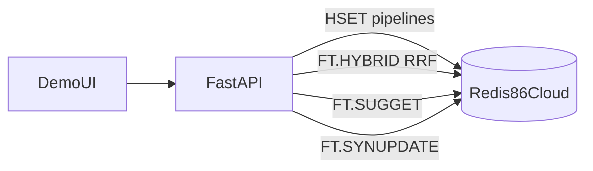

# AGENT.md — AIQFOME Redis Search Demo (Cursor)

This document is the **single source of truth** for any agent working on the **AIQFOME / iFood-style** product search demo: **Redis 8.6+ Cloud**, **HYBRID search** (`FT.HYBRID` + **RRF**), **FTS**, **VSS**, **synonyms**, **autocomplete**, and **geo**. It is **not** a chat or intent-router product.

**Reference implementation in this repo:** [`banco-gabs-taskbar/`](banco-gabs-taskbar/) — copy patterns from there (hybrid command, index definition style, admin CRUD, autocomplete, synonyms). Banco may use **JSON** indexes; this demo stores **flat documents as HASH** under `dish:{id}`. **Do not** port semantic intent routing or concierge flows; this app is **pure search**.

---

## 1. Goals

- Showcase **one data plane** (Redis): **HASH** documents + RediSearch + vectors + geo + admin UX.
- Beat the narrative of “retail search appliance / managed search SaaS”: show **latency**, **native RRF**, **simple ops**, **transparent indexing**.
- Deliver a **demo UI**: search surface + **admin backoffice** (CRUD, index management, tuning knobs, **observability** tab).
- Support **500,000 dish/SKU documents** in Redis — **target count is mandatory** for the demo narrative (see [§7 Scale](#7-scale-500k-dishes--skus)); smaller counts are only for local iteration.

### 1.1 MVP scope and demo bar (Redis 8.6+ narrative)

This repo is an **MVP demo**, not a production marketplace. The goal is to **show what Redis Search does in one data plane** that competitors typically split across **managed retail search** (e.g. marketplace product search, **Google Retail Search**–class appliances): **FTS + geo + vectors + native `FT.HYBRID` + RRF** in **Redis 8.4+ / 8.6+**, with **transparent** index definitions and **low-latency** read paths.

- **Positioning:** one Redis, **no separate search cluster** story — hybrid retrieval, synonyms, autocomplete, and observability **without** a second vendor control plane.
- **Quality bar (internal / Redis audiences):** the UI and API must feel **fast and responsive**: pipelined ingest, bounded autocomplete, hybrid limits tuned for p95, and **per-request timing** surfaced to the client (embedding, Redis search, total).
- **Admin + Observability are core product:** the MVP is not “search + debug logs.” **Catalog admin**, **index/health visibility**, and an **Observability** view (index info, memory, doc counts, slowlog snippet, last search breakdown) are **first-class** so a presenter can explain **what Redis did** during each query.

---

## 2. Non-goals

- No **intent routing**, no **semantic router**, no **chat/concierge**.
- No multi-cloud abstraction; target **Redis 8.6+** APIs directly.
- Production-grade auth is optional; if admin is open, document it as **demo-only**.

---

## 3. Stack and coding style

- **Language:** Python 3.11+ (match or exceed `banco-gabs-taskbar`).
- **Web:** FastAPI, Pydantic models where they reduce duplication, `uvicorn` for local run.
- **Redis:** `redis`-py, **HASH** as the document store (`HSET` / `HGETALL`), RediSearch commands via `execute_command` where the client has no first-class API. **No Redis in Docker/Compose in this repo** — only **`REDIS_URL`** to your managed or self-hosted Redis **8.4+**. Optional **`Dockerfile`** builds the **app** image only (API + UI).
- **Config:** **Environment variables only** for secrets, URLs, tuning numbers, and feature flags. Use `python-dotenv` + a **small `Config` class** (same spirit as [`banco-gabs-taskbar/src/core/config.py`](banco-gabs-taskbar/src/core/config.py)): `os.getenv("NAME", default)`, parse `int` / `float` once, no scattered `os.getenv` in endpoints.
- **Organization:** Keep modules **flat and obvious**: `src/core/config.py`, `src/data/redis_client.py`, `src/data/schemas/` (one file per index or one `food_listing_schema.py`), `src/search/hybrid.py`, `src/search/autocomplete.py`, `src/search/synonyms.py`, `src/api/endpoints/`. **DRY:** one place for index names, key prefixes, and `FT.HYBRID` argument building.
- **Simplicity:** Prefer explicit functions over frameworks. Avoid “enterprise” layers (no repository factory unless truly needed).

---

## 4. Domain model (flat HASH document)

Import shape (from Meli-style retail) maps into a **single search document** per dish/SKU (recommended: **one unified index** for the demo). The payload is **flat**; store it as a **Redis HASH** (no RedisJSON requirement for the primary dish record).

### 4.1 What actually belongs in the search index

End users look for **“hambúrguer artesanal”**, **“pizza margherita”**, **“açaí”** — not `7254018`, not UUID fragments, not `store_id:278`. **Opaque identifiers must not appear in the RediSearch schema** (no `TEXT`, no `TAG`, no prefix match on ids). That avoids nonsense matches, smaller indexes, and demos that feel like “enterprise retail SKU search” instead of food discovery.

- **In the Redis key:** canonical document id as the suffix `dish:{id}` (UUID). You may treat the suffix as the only `id` and **omit a duplicate `id` hash field**; if you omit it, all read paths must derive id from the key (one small helper keeps this consistent).
- **In the HASH (not indexed as TEXT/TAG):** `item_id` (SKU), `store_id` — operational / ERP / admin; resolve docs with `HGETALL dish:{id}` or `SCAN` with prefix — not `FT.SEARCH @item_id:...` on the public index.
- **In the index:** language people type and filters they understand: dish name, description, merchant **name**, category, geo, vector; optional **human** facets (e.g. `category` TAG, price NUMERIC) — never raw catalog ids.

| Source field | In Redis HASH | In RediSearch index | Notes |
|--------------|---------------|---------------------|-------|
| `id` | **Optional** | **No** | Prefer key `dish:{id}` as source of truth; duplicate only if convenient for APIs |
| `item_id` | Yes | **No** | SKU for ERP/import only |
| `item_name` | Yes | TEXT (high weight) | Dish name |
| `item_description` | Yes | TEXT (medium weight) | May be empty |
| `store_id` | Yes | **No** | Use merchant name + geo for discovery; admin uses key or HASH |
| `store_name` | Yes | TEXT (medium weight) | Merchant name |
| `location` | Yes | GEO | Single field **`lon,lat`** string per RediSearch HASH GEO — **do not** duplicate `store_lat` / `store_long` in the HASH |
| `category` | Yes | TAG | Food category |
| `created_at` / `updated_at` | Yes | Not indexed unless you need sort | ISO-8601 strings OK in HASH values |

**Geo (Redis / RediSearch):**

- Validate: `lat ∈ [-90, 90]`, `lon ∈ [-180, 180]`. Fix swapped coordinates in seed data.
- Distance filtering uses the **document point** plus **radius and center at query time** (`USER_LAT`, `USER_LON`, `RADIUS_KM`). No per-document “search radius” field is required for standard geo distance in Redis 8.6+.
- Expose a **GEO** index field (e.g. `location`) sourced from **HASH** fields per RediSearch `ON HASH` rules for your target version — verify in 8.6 docs and integration tests.
- Query side: user passes `USER_LAT`, `USER_LON`, `RADIUS_KM` as query params; apply in FT query predicate (e.g. `@location:[lon lat radius km]`) when provided.

**Embeddings:**

- Field `embedding`: `VECTOR`, **FLOAT32**, **COSINE**, dimension from `EMBEDDING_DIM` env. Store the vector in the HASH as **raw bytes** (little-endian float32 sequence) compatible with the index’s declared dim — same pattern as JSON-backed vectors, but the source field is a HASH value.
- **Model choice:** prefer a **multilingual** embedder with strong **Portuguese** coverage (catalog text is mostly PT). Match `EMBEDDING_DIM` and distance metric to the model card (cosine is typical). Examples of families teams use: multilingual E5-style, BGE-M3-style, or **Qwen3 embedding** (or equivalent); pick one, pin the revision, and document RAM/latency tradeoffs for the demo tier.
- **Text payload for `embed()` (document side):** one deterministic function, reused on create/update/re-embed:
  - **Template:** labeled sections or stable separators (e.g. dish name, description, category, merchant name) — never opaque ids.
  - **Normalize:** trim, collapse whitespace, strip HTML if descriptions are rich text.
  - **Missing fields:** fixed behavior (omit section vs empty string) so two empty descriptions behave identically.
  - **Truncate:** enforce max chars/tokens per model; if truncated, document policy (e.g. cap description last).
- **Query side (bi-encoder demo):** embed the user query string only (add a query prefix only if the chosen model’s documentation recommends it). Do not concatenate the full dish template into the query unless you intentionally adopt a different retrieval pattern.

---

## 5. Redis features to implement

| Capability | Mechanism |
|------------|-----------|
| Full-text | `TEXT` with per-field `WEIGHT`; `TAG` for **human** facets (e.g. category) — **never** index UUID/SKU/store_id |
| Hybrid + RRF | `FT.HYBRID` … `COMBINE RRF` … `CONSTANT` / `KNN` — mirror [`banco-gabs-taskbar/src/search/hybrid_search.py`](banco-gabs-taskbar/src/search/hybrid_search.py) |
| Synonyms | `FT.SYNUPDATE` from packaged JSON — **keep groups tiny**: same dish / same word family only. Bloated groups widen FTS; hybrid + RRF can then rank **irrelevant** rows (vectors do not “know” your synonym intent). This demo boots with [`src/data/default_synonyms.json`](src/data/default_synonyms.json); extend only with real traffic evidence — mirror [`banco-gabs-taskbar/src/data/synonyms.py`](banco-gabs-taskbar/src/data/synonyms.py) for mechanics. |
| Autocomplete | `FT.SUGADD` / `FT.SUGGET` — see [§7.3](#73-autocomplete-at-scale) for 500k |
| Spellcheck (optional) | `FT.SPELLCHECK` when zero/low results |
| Observability | Parse `FT.INFO`, `INFO MEMORY`, key counts; log per-request `embedding_ms`, `redis_search_ms`, `total_ms` (same spirit as unified search metadata in [`banco-gabs-taskbar/src/api/endpoints/search.py`](banco-gabs-taskbar/src/api/endpoints/search.py)) |

**Index management:** Central registry (like [`banco-gabs-taskbar/src/data/redis_indexes.py`](banco-gabs-taskbar/src/data/redis_indexes.py)): create/drop/info, **`FT.CREATE … ON HASH`** — only fields in the schema are indexed. Admin UI shows “indexed fields” vs “stored in HASH only”.

---

## 6. Environment variables (names are contractual)

Define all in `.env.example`. Suggested names:

**Redis**

- `REDIS_URL` — default `redis://localhost:6379/0`

**Search / hybrid**

- `INDEX_NAME` — e.g. `idx:food_listing`
- `KEY_PREFIX` — e.g. `dish:`
- `FTS_WEIGHT`, `VSS_WEIGHT` — metadata defaults (Redis RRF still uses ranks; keep for UI + logging)
- `RRF_K` — default `10`
- `HYBRID_KNN` — top-K for vector leg inside hybrid (tune per latency)
- `DEFAULT_SEARCH_LIMIT` — e.g. `20`
- `USER_GEO_DEFAULT_RADIUS_KM` — optional demo default

**Embeddings**

- `EMBEDDING_MODEL`
- `EMBEDDING_DIM`
- `EMBED_DEVICE` — `cpu` / `cuda` if applicable

**Scale / ingest (500k)**

- `SEED_TARGET_DISHES` — `500000`
- `INGEST_PIPELINE_CHUNK_SIZE` — e.g. `500`–`2000` (`HSET` pipeline batches)
- `INGEST_MAX_PARALLEL` — optional, if using multiprocessing for **CPU-bound** prep only (not for opening 500k Redis connections)
- `AUTOCOMPLETE_MAX_SUGGESTIONS` — cap suggestions stored (e.g. `100000` or derive from popularity)
- `AUTOCOMPLETE_MIN_TITLE_LEN` — skip garbage
- `EMBEDDING_WRITE_MODE` — `all` | `sample` | `none` (see [§7.2](#72-vectors-at-scale))

**Autocomplete key**

- `AUTOCOMPLETE_KEY` — e.g. `ac:aiqfome_dishes`

**App**

- `API_HOST`, `API_PORT` — default demo bind **`8686`** (intentionally not 8000/8080); override per machine.
- `CORS_ORIGINS` if SPA is separate

---

## 7. Scale: 500k dishes / SKUs

### 7.1 Ingestion

- **Never** 500k sequential round-trips without pipelining. Use **pipelines** of `HSET` sized by `INGEST_PIPELINE_CHUNK_SIZE`; flush and repeat.
- Prefer generating **JSONL on disk** first (stream write), then a **streaming reader** that pipelines into Redis so memory stays bounded.
- Create the **search index after a bulk load** *or* use an indexing strategy compatible with your Redis tier (large backfill may need **off-peak** + **SLOWLOG** monitoring). Document expected duration honestly in the README.
- For **rebuild**, support `DROP INDEX` with `DD` only when the operator understands data loss of index metadata; keep HASH keys and `FT.CREATE` + optional `SCAN`-driven reindex pattern if you add alternate flows later.

### 7.2 Vectors at scale

500k dense vectors is **large** (dims × 4 bytes × n + HNSW overhead). For a **sales demo**, make behavior **explicit via env**:

- `EMBEDDING_WRITE_MODE=all` — full hybrid on full catalog (requires sufficient RAM / right Redis tier + HNSW params).
- `EMBEDDING_WRITE_MODE=sample` — embed a **random or stratified subset** (e.g. 50k) for hybrid leg; remaining docs FTS + geo only (still valid story: “hybrid where it matters”).
- `EMBEDDING_WRITE_MODE=none` — **FTS + geo only**; vector query leg skipped or uses query-only embedding against a **centroid index** (only if you implement that; otherwise disable VSS leg clearly in UI).

The agent must not silently OOM: document memory math in README and surface vector doc count in observability.

### 7.3 Autocomplete at scale

Do **not** `FT.SUGADD` every one of 500k raw titles if that harms memory or time.

- Dedupe normalized titles; cap with `AUTOCOMPLETE_MAX_SUGGESTIONS`.
- Optionally only suggest **popular** or **sampled** dishes (env-driven).
- Rebuild autocomplete from **SCAN** or a maintained **sorted set** of hot queries for demo flair — pick one approach and keep code in one module.

### 7.4 Read path

- Hybrid search must use **limits** and **KNN** caps appropriate to p95 targets; expose timings in API JSON for the UI observability tab.

### 7.5 Warm dataset: gerar tudo no seed vs. snapshot `.rdb` (ex.: S3)

Para **500k** docs, gerar de novo no laptop (Faker + embeddings) é **lento** e exige RAM/CPU para o modelo; em instância Redis Cloud o ingest pipelined ainda pode levar **muito tempo** na primeira vez.

**Snapshot RDB (ou backup gerenciado) no S3 (ou equivalente)** costuma ser **melhor** para demo repetível:

- **Prós:** “cold start” da demo em minutos (import/restore) em vez de horas de ingest; mesmo **FTS + índice + vetores** já materializados; ideal para keynote / SE reinicia o ambiente.
- **Contras:** o ficheiro tem de ser **compatível** com a **versão Redis + módulos** do destino; mudaste schema ou `FT.CREATE` → precisas de **novo bake** do snapshot; governança do bucket (acesso, não commitar secrets).

**Abordagem híbrida recomendada:** pipeline offline (batch job ou máquina grande) gera **500k** + `SAVE` / backup → publica artefacto versionado no object storage → runbook da demo: restore + `REDIS_URL`. Para desenvolvimento diário, `SEED_TARGET_DISHES` menor + `EMBEDDING_WRITE_MODE=sample|none` continua válido.

---

## 8. API surface (minimal)

- `GET /api/search` — `q`, optional `lat`, `lon`, `radius_km`, `category`, `limit`, `rrf_k` overrides (**no** “search by SKU id” on this route; that is not a consumer use case)
- `GET /admin/api/dishes/{id}` — load by Redis key `dish:{id}` / optional HASH `id` for backoffice (not RediSearch id field)
- `GET /api/autocomplete` — `q`, `limit`
- `GET /api/observability` — memory, dbsize, index info, doc counts, optional slowlog snippet
- `POST/PUT/DELETE /admin/api/dishes` — CRUD; on write: `HSET` / `DEL` on `dish:{id}`, invalidate caches, conditional re-embed, autocomplete update
- `POST/PUT/DELETE /admin/api/merchants` — if not fully denormalized into each dish, define consistency rules (prefer denormalized **merchant fields on dish doc** for single-index simplicity)
- `POST /admin/api/index/rebuild` — dangerous; guard with env flag `ALLOW_INDEX_REBUILD=true`
- `POST /admin/api/seed/run` — triggers bulk seed with env-controlled counts

---

## 9. UI (tabs)

1. **Search** — results, filters, optional “why matched” from returned metadata.
2. **Admin — Catalog** — CRUD + faker / seed controls.
3. **Admin — Index** — schema view, indexed field list, rebuild/drop (gated).
4. **Admin — Tuning** — weights table (even if “edit + save file” in v1), RRF K, synonym upload/apply.
5. **Observability** — graphs/tables of latency breakdown, Redis memory, index stats (mirror the **banco** observability spirit without chat).

---

## 10. Agent rules of engagement

1. **Read this file first** before adding features.
2. **Prefer adapting** [`banco-gabs-taskbar`](banco-gabs-taskbar) code for hybrid, synonyms, autocomplete, and admin patterns; strip bank/chat/router specifics.
3. **Config:** no magic numbers in handlers — read from `Config` populated by env.
4. **DRY:** one builder for `FT.HYBRID` arguments; one place for document key naming.
5. **Identifiers:** do **not** add `id`, `item_id`, or `store_id` to `FT.CREATE` — not even as low-weight TEXT or TAG “for admin”; keep the consumer index aligned with **natural-language** search only. Prefer **key suffix** as canonical `id`; a duplicate `id` hash field is optional, never indexed.
6. **Scale:** any change to document shape or index must consider **500k** ingest and memory (update [§7](#7-scale-500k-dishes--skus) and `.env.example`).
7. **Tests:** at least smoke tests for `FT.SEARCH` / `FT.HYBRID` parsing and one CRUD round-trip against **`REDIS_URL`** (any small Redis 8.4+ instance you provision) — full 500k is CI-optional / manual.

---

## 11. Acceptance criteria (demo)

- RediSearch schema has **no** indexed `id` / `item_id` / `store_id`; consumer queries are **natural language** only (e.g. dish + merchant name), with admin using **keys** for exact lookup.
- Search returns ranked dishes with merchant + geo context; hybrid works when `EMBEDDING_WRITE_MODE` allows vectors.
- Autocomplete and synonyms visibly improve recall on canned demo queries.
- Admin can list/edit/delete documents and trigger seed **with configured counts** up to `SEED_TARGET_DISHES`.
- Observability tab shows **index exists**, **approx doc count**, **memory**, and **request timings**.
- Loading **500k** HASH documents completes with **documented** pipeline settings on a reference machine/tier; vectors optional per env.

---

## 12. Architecture sketch

---

*Last updated: this document lives alongside the app in this package; references `../banco-gabs-taskbar` for hybrid/search patterns — **strip** any banco habit of indexing opaque ids for this food demo.*
